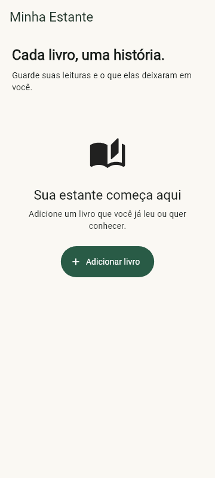
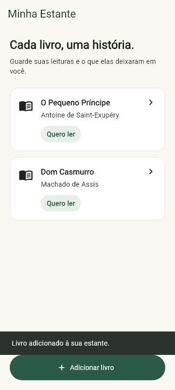
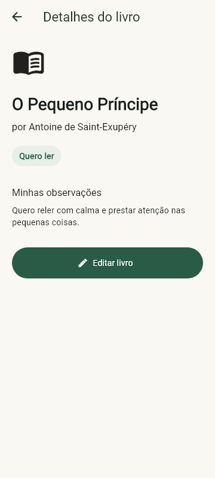
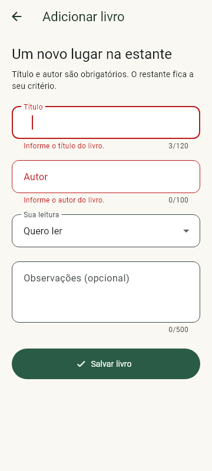
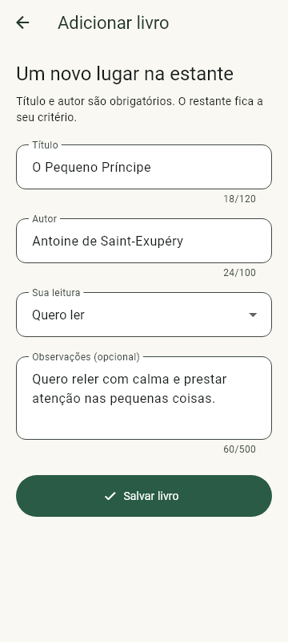
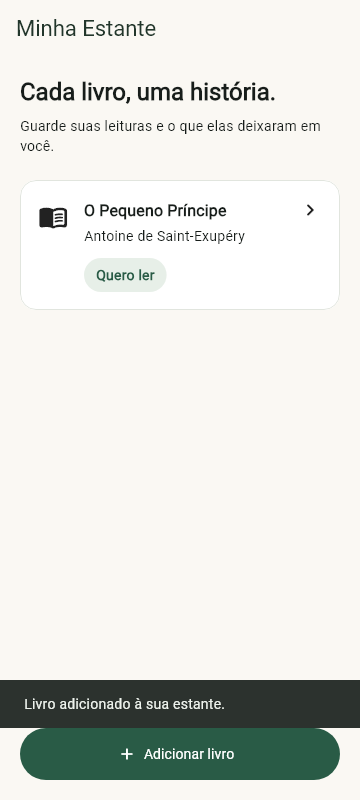
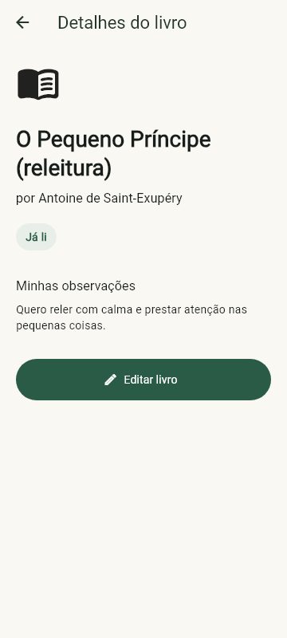
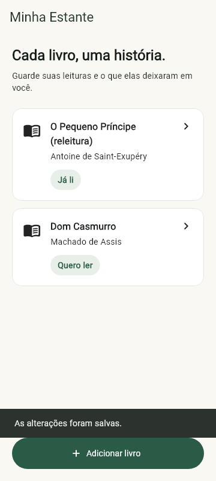
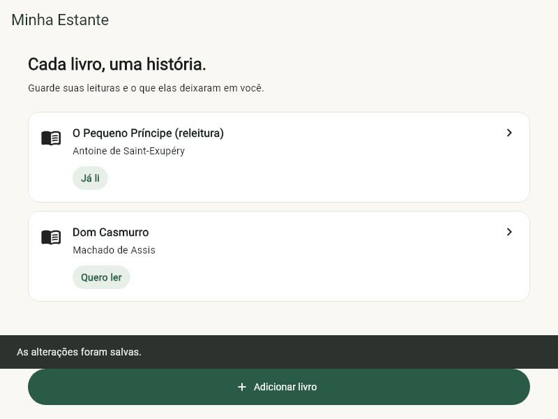

# Relatório do trabalho final

Desenvolvimento Mobile I — Catálogo Pessoal em Flutter

Minha Estante

Kayann Leandro de SáMatrícula: 0031623Turma informada: 4º período2º semestre de 2026

1. Identificação e resumo

Domínio e problema. Minha Estante é um catálogo pessoal de livros. A ideia é reunir, em um lugar simples, o que a pessoa quer ler, está lendo ou já leu, junto com pequenas anotações. O público é quem gosta de ler e quer acompanhar suas leituras sem preencher um cadastro complicado.

Fluxo principal. A tela inicial mostra a coleção. Ao tocar em um livro, abre-se o detalhe daquele item. O botão Adicionar livro leva ao formulário de criação; Editar livro, no detalhe, abre o mesmo formulário com os dados preenchidos. Depois de salvar a edição, o detalhe é atualizado. Ao voltar à lista, o cartão também mostra a mudança.

Escopo do M1. Estão implementados lista dinâmica, estado vazio, detalhe, criação, edição, validação, tema e adaptação de layout. Os dados ficam no estado local durante a execução. Salvar os livros entre sessões seria uma evolução futura e não faz parte desta entrega.

Sobre as evidências. As figuras foram geradas pelo renderer do Flutter nos testes de widget. Os tamanhos indicados são pixels lógicos. Não são capturas de um celular ou emulador. O APK foi compilado separadamente.


# Versão e requisitos

2. Repositório, versão e execução

Versão: 1.0.0+1 · Flutter 3.47.6 · Dart 3.13.5Tag dos fontes e evidências: m1-v1.0.0Commit do projeto: 255975aae308f7b52546ac90fab8f744c65868e6Repositório: https://github.com/Sc00pex/M1_trabalho_finalCópia local: entrega/minha-estante.bundle.

Artefato Android: app-release.apk, APK release, 47.5 MiB. Geração confirmada no log de build. Assinado com chave de desenvolvimento, para instalação e avaliação. Android mínimo: 7.0 (API 24).

```text
git clone https://github.com/Sc00pex/M1_trabalho_final.git
cd M1_trabalho_final
git checkout m1-v1.0.0
flutter pub get
flutter analyze
flutter test
flutter run
flutter build apk --release
```

É preciso ter Flutter e Android SDK configurados e as licenças Android aceitas. A tag identifica os fontes, testes, capturas e logs usados aqui. O PDF e o registro de versão são incluídos depois, em um commit de documentação. O SHA-256 do APK está em relatorio/versao.json. A cópia Git também permite reproduzir a versão.

3. Matriz dos 13 critérios

| Nº | Requisito | Evidência | Arquivo ou classe |
|---|---|---|---|
| 1 | Identificação, objetivo e fluxo | p. 1, seção 1 | README.md; app.dart |
| 2 | Repositório, versão e instruções | p. 2, seção 2 | README.md; versao.json |
| 3 | Execução e artefato Android | p. 2 e 7 | logs/build.txt; APK |
| 4 | Duas ou mais telas e navegação | p. 3, evidência B | screens/; Navigator |
| 5 | Coleção dinâmica e estado vazio | p. 3, evidência A | CatalogoPage |
| 6 | Detalhe do item selecionado | p. 3, evidência B | DetalheLivroPage |
| 7 | Formulário e validação | p. 4, evidência C | FormularioLivroPage |
| 8 | Criação e edição no estado local | p. 5, evidência D | CatalogoPage; Livro.id |
| 9 | Modelo e widgets organizados | p. 7, estrutura | models/; widgets/ |
| 10 | Dois espaços sem overflow | p. 6, evidência E | ConteudoCentral; testes |
| 11 | Tema e acessibilidade | p. 6, verificações | AppTheme; LivroCard |
| 12 | Análise e teste de widget | p. 7, saídas reais | test/catalogo_test.dart |
| 13 | Decisões, fontes e autoria | p. 8, seção 6 | README.md; relatório |

# Coleção e navegação

4. Evidências visuais e funcionais

Evidência A — estado vazio e coleção. O teste inicia uma sessão sem livros e registra a primeira tela. Depois cadastra O Pequeno Príncipe e Dom Casmurro. A lista passa a mostrar dois itens, sem dados fixos no código.

Evidência B — navegação e detalhe. Na coleção, o teste toca em O Pequeno Príncipe. O destino mostra o título, o autor e as observações desse livro; não os de Dom Casmurro. Origem: CatalogoPage. Destino: DetalheLivroPage.







Figuras A1, A2 e B1, da esquerda para a direita. Estante vazia; coleção após duas criações; detalhe do item selecionado. As três imagens usam 360 × 800 pixels lógicos.

O botão Adicionar livro abre o formulário. O cartão inteiro é uma área de toque e recebe um rótulo semântico com título, autor e situação da leitura. A seta Voltar retorna à tela anterior.


# Formulário e validação

Evidência C — entrada inválida e envio válido

O formulário usa Form e TextFormField. Título e autor são obrigatórios. Valores compostos somente por espaços também são recusados, pois a validação usa trim(). Situação da leitura e observações completam o cadastro; as observações são opcionais.





Figuras C1 e C2. À esquerda, a tentativa inválida mostra “Informe o título do livro” e “Informe o autor do livro”. À direita, os campos foram preenchidos com dados válidos. O envio desse formulário é confirmado pela coleção na figura D1, na página seguinte.

O teste também verifica que a rota não é encerrada com campos inválidos. Os rótulos continuam visíveis após o preenchimento. Os campos seguem a ordem título, autor, leitura e observações; o formulário rola quando falta altura.


# Criação e edição

Evidência D — alterações refletidas no estado local

A sequência começa com a criação de O Pequeno Príncipe. Depois da inclusão de Dom Casmurro, o primeiro livro é aberto para edição. O título muda para O Pequeno Príncipe (releitura) e a leitura para Já li. Ao voltar do detalhe, a coleção mostra os novos valores e preserva o segundo livro.







Figuras D1, D2 e D3. Livro criado; detalhe atualizado depois de salvar; lista atualizada ao voltar. A comparação do título e da etiqueta de leitura mostra o resultado das duas operações.

Como o estado é atualizado. O formulário devolve um objeto Livro por Navigator.pop. Na criação, CatalogoPage adiciona esse objeto à lista. Na edição, o identificador do livro é mantido; ao receber o resultado do detalhe, a tela substitui apenas o item correspondente com setState.

Cancelar o formulário não modifica a coleção. Esse comportamento também foi verificado por um teste separado. Os livros permanecem disponíveis durante a sessão; não existe persistência em arquivo ou banco de dados.


# Layout e acessibilidade

Evidência E — o mesmo conteúdo em dois espaços

A coleção editada é renderizada primeiro em 360 × 800 e depois em 800 × 600 pixels lógicos. Os dados são os mesmos. ConteudoCentral limita o conteúdo a 760 pixels; a lista usa rolagem e os textos dos cartões podem quebrar linha.




Figuras E1 e E2. A mesma coleção no espaço estreito e no espaço largo. O botão de adicionar fica na área inferior do Scaffold, acima da qual aparece a mensagem de confirmação. A interface não registrou exceção de overflow.

Acessibilidade efetivamente verificada

Os testes executaram androidTapTargetGuideline, labeledTapTargetGuideline e textContrastGuideline no estado vazio e na coleção, nos dois tamanhos. As verificações passaram. Os textos também foram ampliados a 200% com título e autor longos; lista, detalhe e formulário continuaram acessíveis por rolagem.

Na figura E1, o cartão tem rótulo semântico com título, autor e leitura. O teste também abre o detalhe pela ação semântica de toque do cartão. Na figura C2, os campos têm rótulos permanentes. Botões têm texto e áreas de toque verificadas. As cores vêm de um tema Material 3. Não foi feita avaliação manual com TalkBack em dispositivo físico.


# Organização e qualidade

5. Estrutura e componentização

```text
lib/main.dart                 entrada
lib/app.dart                  MaterialApp em pt-BR
lib/models/livro.dart          modelo e enum de leitura
lib/screens/                  lista, detalhe e formulário
lib/widgets/                  cartão, status e largura
lib/theme/app_theme.dart       tema
test/catalogo_test.dart        quatro testes de widget
```

Widget extraído. StatusLivro cuida da etiqueta de leitura, usada tanto no cartão da lista quanto no detalhe. A extração evita repetir estilo e espaçamento. ConteudoCentral reúne a margem e o limite de largura das três telas.

Análise, teste e build — saídas reais

```text
$ flutter analyze
No issues found! (ran in 1.9s)

$ flutter test --reporter=expanded
00:00 +0: estado vazio, validação, criação, detalhe e edição na coleção
00:01 +1: cancelar formulário não cria nem altera livro
00:02 +2: texto ampliado, rolagem e acessibilidade em Size(360.0, 800.0)
00:02 +3: texto ampliado, rolagem e acessibilidade em Size(800.0, 600.0)
00:03 +4: All tests passed!

$ flutter build apk --release
Built build\app\outputs\flutter-apk\app-release.apk (47.5MB)
```

Os logs completos estão em relatorio/logs. A execução usada para as imagens acrescenta --dart-define=GERAR_EVIDENCIAS=true ao comando de testes, para gravar as capturas; as asserções são as mesmas do teste normal.

Teste principal. “estado vazio, validação, criação, detalhe e edição na coleção” verifica toda a sequência mostrada nas figuras. Os outros três testes cobrem cancelamento e acessibilidade em 360 × 800 e 800 × 600, com texto a 200% e espaço reduzido pelo teclado.

APK confirmado: 47.5 MiB; pacote br.com.kayann.minha_estante. O hash completo do arquivo está em relatorio/versao.json. A compilação foi verificada; não houve instalação em aparelho físico.


# Decisões, fontes e autoria

6. Decisão técnica

Foi usado setState com uma lista de Livro na tela do catálogo. Para três telas e um estado pequeno, essa escolha deixa o fluxo de atualização fácil de acompanhar e dispensa bibliotecas adicionais. Como consequência, o catálogo é reiniciado ao encerrar a execução. A identificação por id permite editar um livro sem depender de seu título.

Dificuldade e solução observadas

Nos primeiros testes, a mensagem de confirmação cobria o botão de adicionar, e uma composição fixa estourava o espaço com texto ampliado. A investigação comparou o resultado do teste e a posição dos controles. O botão foi colocado no bottomNavigationBar e o cabeçalho passou a fazer parte da lista com rolagem. A mensagem é encerrada antes de abrir outra tela. Os testes do fluxo e dos dois tamanhos passaram depois dos ajustes.

Fontes e recursos externos

Flutter — formulários e validaçãohttps://docs.flutter.dev/cookbook/forms/validation

Flutter — navegação entre telashttps://docs.flutter.dev/cookbook/navigation/navigation-basics

Flutter — acessibilidadehttps://docs.flutter.dev/ui/accessibility

Flutter — testeshttps://docs.flutter.dev/testing/overview

Recursos do aplicativo: Flutter, flutter_localizations, ícones Material e Roboto do SDK. flutter_test e flutter_lints foram usados na verificação. Nenhuma imagem externa de livro foi utilizada. ReportLab gerou o PDF; PyMuPDF e pypdf auxiliaram a conferência do documento.

Contribuições. Houve assistência do Codex na elaboração e revisão do código, dos testes, da documentação e deste relatório. O tema foi confirmado por Kayann, que também forneceu nome, matrícula e período. Essa contribuição é informada para deixar a origem do trabalho transparente.

Declaração

Declaro que este relatório descreve a versão identificada do meu projeto, que as fontes e contribuições externas foram informadas e que não publiquei chaves, senhas, tokens ou outros segredos.

Kayann Leandro de Sá
